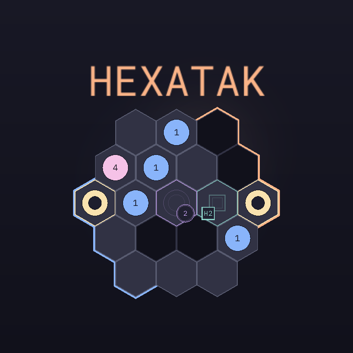
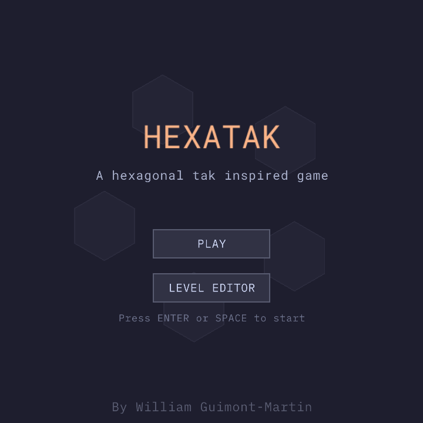
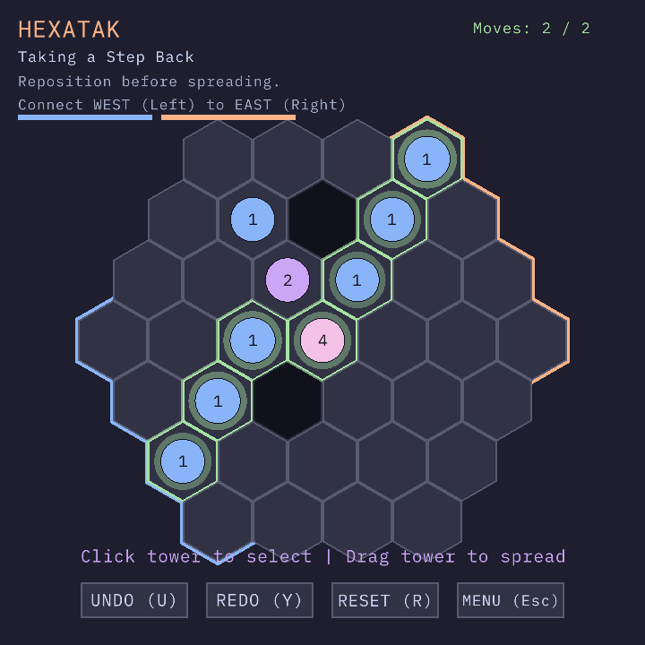
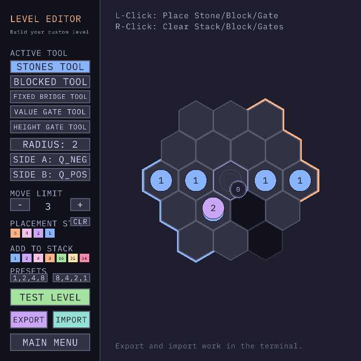

# cgame

Personal game library in C.

## Build

This repo is built around CMake and reused across multiple targets.
The top-level `Makefile` contains the most useful commands.
The build system was mostly borrowed from [willGuimont/faisceau](https://github.com/willGuimont/faisceau), 
another raylib project reimplementing algorithms.

```bash
# Build the Hexatak desktop target in debug mode
make build-debug APP=hexatak
# Run the Hexatak desktop target in release mode
make run-release APP=hexatak
# Build the Hexatak web target
make web-build-app APP=hexatak
# Serve the web build locally (requires python)
make web-serve
# Deploy the web build (gh-pages)
make web-deploy
```

## Hexatak



### Description

The game is available [here](https://willguimont.com/cgame/hexatak/).

This game was submitted to the [`raylib 6.x gamejam`](https://itch.io/jam/raylib-6x-gamejam).

Hexatak is a hex-grid puzzle about merging and stacking stones to build a contiguous road between two board edges.
You move whole stacks one tile at a time, spread towers across multiple cells, merge matching stone values,
and satisfy exact bridge conditions to complete each level within a move limit.
To add a bit of challenge, your road must navigate gates that require specific stone values, or height gates that
require a specific stack height.

When the jam themes were revealed to be `hex + merge`, I was completely stumped.
I couldn't think of any idea that felt interesting to make.
At first, I considered making a Zachtronics-style organic chemistry game, where you would build cyclic molecules
like benzene and fuse monomers into polymers, but I just could not find a way to make it *fun*.
So I started looking at board games I like to see how they might fit the theme.
That led me back to [Tak](https://en.wikipedia.org/wiki/Tak_(game)), a game I often played with friends, and for
which I had already designed a [3D-printable board](https://cults3d.com/en/3d-model/game/tak-with-storage-4x4-5x5-6x6-board).
I stole the ideas of stacking and spreading stacks, added a few gates to make things a bit more interesting, and 
Hexatak was born!

### Features

* 18 handcrafted puzzle levels with escalating mechanics
* Stack movement, spreading, and value merges
* Puzzle elements: blocked cells, fixed bridge anchors, value gates, and height gates
* Built-in level editor for testing and authoring new puzzles (I used it to design the puzzles of the game!)
* Some dev tooling only available when building in `debug`
  * Simple solver to verify that levels are solvable (will crash for larger levels if the search space is too large...)
  * Partial solving for larger levels (you can mark stones as static to speed up the search)
  * Dev buttons to quickly load existing levels

### Controls

Keyboard:

* `U`: undo
* `Y`: redo
* `R`: reset the current level (you can undo a reset)
* `Esc`: return to the menu or leave the editor
* `Space` / `Enter`: advance dialogs and continue after a cleared level

Mouse:

* Left click a stack, then left click a target cell to move it one step
* Left click and drag from a stack to spread it in a direction
* Right click while a stack is selected to cancel the selection
* Use the on-screen buttons for undo, redo, reset, etc.

### Screenshots









### Developers

* [William Guimont-Martin](https://github.com/willGuimont): design, code

### Links

* Web build: https://willguimont.com/cgame/hexatak/
* Source repository: https://github.com/willGuimont/cgame
* itch.io Release: not published
